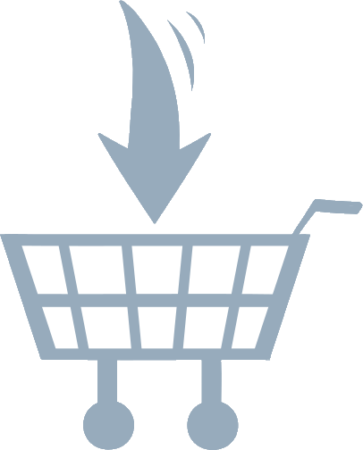

#  Unified Shopping List Helper
The Unified Shopping List Helper is an Alexa skill designed to integrate Alexa with the [Unified Shopping List](https://shopping-lists.genson.dev). Linking this skill allows you to link any of your Alexa lists (such as your shopping list) to your Unified Shopping List. You can [enable the skill and link your account from the skill page](https://www.amazon.com/dp/B0BR8KW2WL).

The Unified Shopping List Helper leverages the Unified Shopping List API to send item updates, and exposes the Alexa REST API through an event callback system in Amazon [DynamoDB](https://aws.amazon.com/dynamodb/).

For more information on the Unified Shopping List, check it out on [GitHub](https://github.com/michael-genson/Unified-Shopping-List).